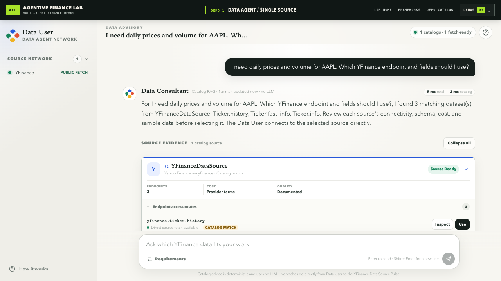

# 当金融工具越来越多，系统真正缺少的是清晰的责任边界

MCP 解决了工具访问的标准化问题，Skills 把可复用的操作方法整理成指令与流程。它们都很重要。但当一个金融应用从行情扩展到基本面、公告、宏观数据、风险和内部组合数据时，新的瓶颈会迅速出现：模型面对的目录越来越大，来源之间的标识符、参数、权限、频率限制和失败方式也越来越不同。

把所有能力平铺成一个巨大的工具列表，模型需要先理解大量与当前问题无关的定义。把它们压缩成一个 `fetch_everything(spec)` 又会制造另一个问题：来源选择、字段映射、权限和错误边界被藏进一个不透明的路由器。

Agentive Finance Lab 的 Episode 1 展示了一种更窄、也更容易验证的做法：让“专业角色”而不是“成千上万个函数”成为发现和协作的单位。

## 三个角色，一条可检查的路径

单一数据源演示中有三个可寻址参与者：

1. **Data User（数据用户）**负责理解用户需求，并在来源确认后直接调用该来源。
2. **Data Consultant（数据顾问）**负责保存在内存中的端点与字段文档，并根据这些文档给出确定性的目录建议。
3. **YFinance Data Source（YFinance 数据源）**负责自己的端点规范和 `data_fetch` 执行。

它们都注册到一个进程内的 **Plaza**。Plaza 提供注册、发现、解析和本地请求/返回路径，但它不是金融数据提供方，也不会解释、合并、缓存或转发供应商数据。

第一阶段是选择来源：

```text
Data User
  → Plaza
  → Data Consultant:data_advice
  → 基于 YFinance 目录文档的建议
```

这里保留了 `catalog_rag` 的策略标签，但 lite 版本没有调用大语言模型生成答案。它执行的是对同步文档的确定性检索，而不是一个生产级生成式 RAG 系统。

第二阶段是取得数据：

```text
Data User
  → Plaza
  → YFinance Data Source:data_fetch
  → 供应商结果、规范化字段、警告与错误边界
```

Data Consultant 不接收供应商结果。它负责“哪个来源和端点适合”，不负责代理实际数据。Data User 仍是调用方，YFinance Data Source 是执行所有者，Plaza 只协调这个显式交接。


## 为什么这条边界对金融场景重要

一个“获取 AAPL 一个月日线”的请求，看起来简单，实际上涉及需求理解、来源选择、参数验证、认证边界、供应商调用和失败解释。如果这些责任都藏在一个模型和一个提示词后面，出错时只能得到“模型失败了”这个无效结论。

金融数据还存在一个更敏感的问题：静默切换供应商并不只是技术兜底。它可能改变来源、字段定义、复权方法、时间点、权限和允许用途。因此，本演示不使用运行时假数据、缓存结果、测试夹具或其他来源来掩盖失败。

这套拆分要证明的是可检查性：谁理解需求，谁掌握目录知识，谁触及供应商，失败发生在哪个边界。它不声称多代理会带来更好的预测、更高收益、更低成本或更准确的市场数据。

## 一次真实、但严格限定的捕捉

本次 Episode 1 短片在 2026 年 8 月 28 日（Asia/Taipei）从本地 Demo 1 捕捉。画面只包括：Data User 提问、Data Consultant 返回 YFinance 目录建议、选择 `yfinance.ticker.history`、Data User 通过 Plaza 发起 `data_fetch`，以及 YFinance 返回 23 行规范化结果。

短片没有打开或执行 Alpha Vantage、FRED，也不会用它们的画面或结果补足叙事。市场数值只作为当次供应商响应存在，不构成文章结论、投资信号或收益主张。



*图 2：本次本地捕捉中的目录建议画面。后续 `data_fetch` 由 Data User 直接调用 YFinance Data Source。*

## MCP 与 Skills 仍然有位置

多代理协调层不是为了替代 MCP 或 Skills。一个数据源代理仍可在自己的边界内暴露精简的 MCP 能力；数据顾问也可以使用 Skill 执行一致的评估流程。协调层补充的是应用责任：由哪个专业角色拥有任务、如何找到它，以及请求和结果如何在不隐藏来源的情况下移动。

Agentive Finance Lab 是从 FinMAS——原始完整金融多代理应用——缩减而来的可运行公开示范。它不包含分布式健康路由、权限引擎、成本与配额策略、供应商故障转移、账户、账单或持久化数据服务。Prompits、Phemacast 和 Attas 由 Retis AI Pte Ltd 所有。

原始英文文章（已验证）：
https://agentivefinancelab.substack.com/p/mcp-and-skills-hit-their-limits-in

开源仓库（已验证）：
https://github.com/alvincho/agentive-finance-lab

## 讨论

当一次金融数据请求失败时，应该由用户侧代理、来源选择专家，还是具体数据源来解释失败？在允许切换供应商之前，你会要求系统保留哪些证据？

---

**教育用途声明**

Agentive Finance Lab 是教育用途的软件示范，不提供投资建议、交易建议或数据权利，也不保证供应商的可用性、时效性、完整性或准确性。yfinance 与 Yahoo 无关联；Yahoo Finance 数据仅供个人使用，并受适用条款约束。

**交付状态**

目标公众号仅允许为“AI智域边界”，公众号 ID 为 `retis_ai`，交付方式为 `browser_automation`。截至 2026 年 8 月 28 日，账号与个人验证状态均为未验证，因此暂不使用公众号 API；发布任务会通过已登录且经核对的 Chrome 会话自动填写正文、封面、摘要与素材，不得要求用户手动复制粘贴，也不得替换为其他已登录公众号。
