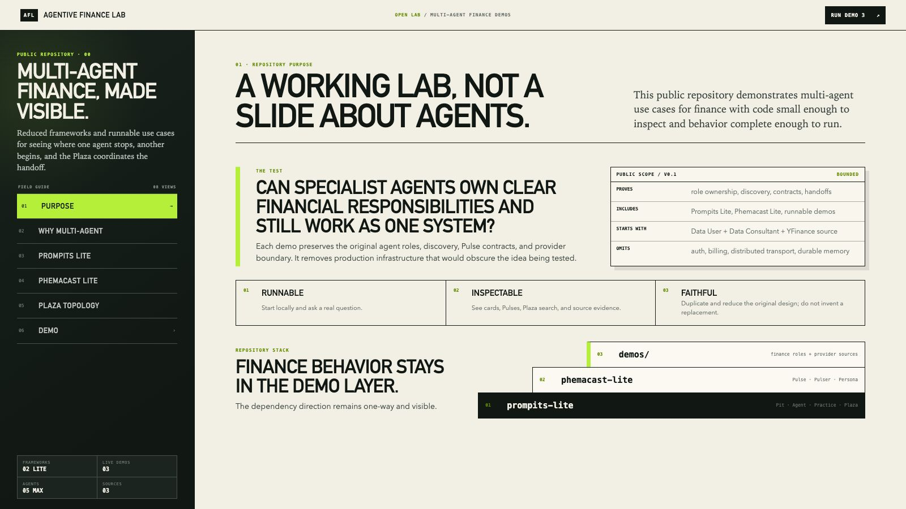

# 先把多智能体金融实验室跑起来，再学习框架术语

架构图可以把任何系统画得很完整，但图中的方框和箭头并不能证明代码真的能够安装、启动、注册参与者并返回可检查的结果。

Agentive Finance Lab 的 Episode 2 选择从运行开始：克隆公开仓库，创建独立 Python 环境，启动本地服务，检查健康端点，然后找到三个 Data Agent 演示。等读者先得到一个可复现的结果，后续文章再解释 Pit、Plaza、Practice、Pulse、Pulser 和 Persona。

本次操作不需要 API 密钥、数据库、Node.js、模型账号或外部智能体服务。你只需要 Git、CPython 3.11 或更高版本，以及安装 Python 依赖时的网络连接。

## 第一步：检查 Python

macOS 或 Linux：

```bash
python3 --version
```

Windows：

```powershell
py -3 --version
```

版本必须是 3.11 或更高。

## 第二步：克隆仓库并创建环境

```bash
git clone https://github.com/alvincho/agentive-finance-lab.git
cd agentive-finance-lab
python3 -m venv .venv
source .venv/bin/activate
python -m pip install -e .
```

Windows PowerShell 可以使用：

```powershell
py -3 -m venv .venv
.\.venv\Scripts\Activate.ps1
python -m pip install -e .
```

如果 PowerShell 禁止激活脚本，可以直接调用虚拟环境中的 Python：

```powershell
.\.venv\Scripts\python.exe -m pip install -e .
```

## 第三步：启动本地实验室

在仓库根目录执行：

```bash
python demos/data-agent-network-demo/run.py --open
```

`--open` 会请求默认浏览器打开本地首页。如果浏览器没有自动打开，服务仍然可以正常运行，直接访问 `http://127.0.0.1:8000/` 即可。

当终端显示下面的地址时，保留这个终端窗口：

```text
Uvicorn running on http://127.0.0.1:8000
```

## 第四步：检查第一个网络

在第二个终端执行：

```bash
curl --fail --silent http://127.0.0.1:8000/health
```

兼容健康视图会返回：

```json
{
  "status": "ok",
  "demo": "data-agent-network",
  "participants": 3,
  "sources": 1,
  "provider": "yfinance"
}
```

这表示本地 Single Source 网络已经启动，包含 Data User、Data Consultant 和一个 YFinance Data Source。它不表示 Yahoo Finance 一定可访问，也不保证之后的实时请求一定成功，更不代表任何数据适合投资决策。


## 三个演示分别在哪里

本地首页提供三个入口：

1. **Single Source（单一数据源）**：`/demos/data-agent-network/`
2. **Multiple Sources（多个数据源）**：`/demos/data-agent-network/multiple-sources/`
3. **Real Data（真实数据路径）**：`/demos/data-agent-network/real-data/`



Demo 1 注册 Data User、Data Consultant 和一个 YFinance Data Source。Demo 2 保留相同的用户侧和顾问角色，并加入 YFinance、Alpha Vantage 和 FRED 三个独立的数据源目录。Demo 3 在隔离的本地 Plaza 中实例化相同的五参与者形态，并公开受限的实时获取样例。

打开这些页面、请求目录建议或查看端点规格都不需要密钥。YFinance 本身不需要密钥。只有实时调用 Alpha Vantage 或 FRED 时，才需要把可选密钥放在服务器端、已被 Git 忽略的 `.env` 文件中。密钥不应该进入浏览器存储，也不应该成为 Pulse 输入。

## 先观察建议与执行的区别

在 Single Source 页面输入：

```text
I need free daily prices and volume for AAPL.
```

Data Consultant 会从同步到内存的端点文档中返回建议。这条建议路径不访问上游供应商，也没有语言模型生成步骤。只有后续的 `data_fetch` 才会跨过所选数据源的供应商边界。

这次只需要确认两件事：目录建议能够运行，供应商执行是另一个清晰可见的动作。

## 这个结果证明了什么

它证明公开缩减版仓库可以安装、启动、注册参与者，并通过保留的应用边界暴露健康检查和三个演示入口。这为后续检查依赖层、注册机制和 Pulse 调用提供了真实基础。

它没有证明生产可靠性、安全性、数据权限、供应商可用性、预测能力或投资回报。运行时也不会用测试夹具、缓存结果、合成价格或另一个供应商来掩盖失败。

下一集将解释依赖方向 `demos → phemacast-lite → prompits-lite`，以及为什么这里的“Lite”表示缩减范围，而不是重写原始架构。

开源仓库：
https://github.com/alvincho/agentive-finance-lab#quick-start-clone-and-run-the-ui

原始英文文章只会在 Substack 正式发布并验证后由自动任务加入；本文的核心内容不依赖外部链接。

---

**教育用途声明：**Agentive Finance Lab 是教育用途的软件演示，不提供投资建议、交易建议或数据权利，也不保证供应商的可用性、时效性、完整性或准确性。实时数据仍受各供应商条款与限制约束。
