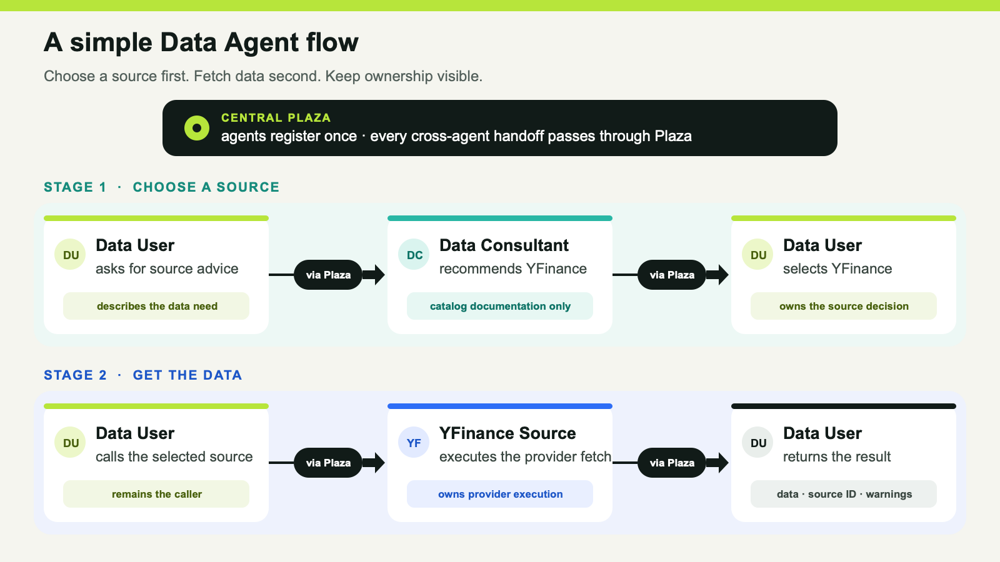

# When Finance Outgrows a Flat Tool Catalog

*A runnable multi-agent demonstration of explicit ownership, centralized discovery, and a direct source boundary.*

> Editor’s note: This is an adaptation for *Agentive Futures*. The original Episode 1 was published by Agentive Finance Lab on Substack: https://agentivefinancelab.substack.com/p/mcp-and-skills-hit-their-limits-in

MCP gives applications a common way to discover and call tools. Skills add reusable operating instructions. Both are useful. Neither, by itself, answers a question that becomes uncomfortable in financial software: what happens when the model-visible catalog grows from a few clear operations into hundreds of sources and thousands of similar functions?

Prices, fundamentals, filings, estimates, options, rates, risk, and internal portfolio data do not merely add more endpoints. They add different identifiers, permissions, adjustment policies, vintages, quotas, failure modes, and permitted uses. If one assistant sees all of that as a flat menu, it must spend context understanding the menu before it can answer the request. If the menu is hidden behind a single `fetch_everything(spec)` tool, the count falls but the ownership, provider decision, and failure boundary become harder to inspect.

The smallest useful alternative is not “more agents.” It is bounded responsibility.

## Make the specialist the unit of discovery

Agentive Finance Lab demonstrates three roles in its single-source example:

- **Data User** owns the request and the selected-source call.
- **Data Consultant** owns synchronized endpoint documentation and deterministic catalog advice.
- **YFinance Data Source** owns its provider contract and executes its own `data_fetch` Pulse.

All three register with one in-process **Plaza**. Plaza provides centralized registration, discovery, resolution, and the local request/return path. It does not become a financial-data provider, interpret observations, or proxy a provider payload through the Consultant.

The flow deliberately has two stages.

First, Data User asks which source and endpoint fit the request. Data Consultant searches its transient copy of the YFinance catalog and returns evidence-grounded advice. The implementation retains a `catalog_rag` policy label, but the lite demo does not run a language-model generation step. It is deterministic lexical retrieval over documentation.

Second, Data User selects `yfinance.ticker.history`, resolves the source, and invokes `data_fetch` on the YFinance Source through Plaza. The Consultant stays out of the provider-result path. The source returns the provider view, canonical field mappings, warnings, and a visible error boundary.

That separation is the point. Advice and execution are related, but they do not have the same owner.

## A tighter standard for a multi-agent finance demo

Counting agents is easy and rarely informative. A more useful demo makes five properties observable:

1. **Ownership:** each participant has a responsibility another developer can explain.
2. **Discovery:** participants are found through registered metadata and advertised Pulse capabilities.
3. **Structured interaction:** cross-agent work uses named request and response contracts.
4. **Inspectable flow:** the UI and code show who asked, who advised, what was selected, and which participant touched the provider.
5. **Source-set extensibility:** another source can join without replacing the user-facing workflow.

These are architectural properties, not investment-performance claims. The repository does not claim that more agents create better forecasts, higher returns, cheaper data, lower latency, or more accurate observations.

## Why the boundary matters in finance

Consider a request for one month of daily AAPL prices. The system must understand the request, choose a source, validate an endpoint contract, supply valid parameters, handle the provider boundary, and report failures honestly.

When every responsibility sits behind one prompt, “the model failed” is the likely diagnosis. That does not tell a developer whether the request was misunderstood, the source was inappropriate, the contract was wrong, authentication failed, or the upstream provider was unavailable.

In finance, silently swapping providers is especially risky. A fallback can change provenance, fields, timing, adjustment policy, entitlements, or permitted use. The lite demo therefore does not hide a failure behind a fixture, cached observation, synthetic value, or another provider.

The value of the multi-agent split is not magic. It is accountability: the Data User owns intent, the Consultant owns source knowledge, the Data Source owns execution, and Plaza makes the handoffs explicit.

## MCP and skills still belong in the system

This architecture does not discard MCP or skills. A Data Source agent can expose a compact MCP surface for its own domain. A Consultant can use a skill to apply a repeatable evaluation procedure. The coordinated-agent layer adds the application-specific question that a flat tool catalog does not resolve on its own: which specialist owns the work, how is that specialist found, and how does the request move to it without hiding provenance?

That distinction keeps the claim narrow. Agentive Finance Lab is not an enterprise registry. It does not implement distributed health routing, an entitlement engine, quota or cost policy, provider failover, user accounts, billing, persistent memory, or a hosted data service. It is a reduced, runnable extraction from FinMAS, the original full financial multi-agent application.

Prompits, Phemacast, and Attas are owned by Retis AI Pte Ltd. The public lab preserves the architectural spine while removing production services so the handoff can be followed on one computer.

## Run the narrow claim

The Episode 1 path uses one external financial-data source: YFinance. A visitor can ask which endpoint supplies historical price and volume fields, inspect `yfinance.ticker.history`, and then run the source-owned `data_fetch` path. Provider access occurs only at that final boundary.

The repository also contains later multi-source demos with YFinance, Alpha Vantage, and FRED, but those are not part of the Episode 1 Short. The reusable short master demonstrates only the captured Data User → Plaza → Data Consultant → YFinance flow; it does not invent an Alpha Vantage or FRED execution.

The more useful question is not how many agents appear in the diagram. It is whether another developer can inspect every important handoff and add a bounded source without redesigning the whole system.

Explore the repository: https://github.com/alvincho/agentive-finance-lab

Original Episode 1: https://agentivefinancelab.substack.com/p/mcp-and-skills-hit-their-limits-in

---

*Agentive Finance Lab is an educational software demonstration. It does not provide investment advice, trading recommendations, data rights, or guarantees about provider availability, freshness, completeness, or accuracy. yfinance is unaffiliated with Yahoo; Yahoo Finance data is intended for personal use and remains subject to applicable terms.*
