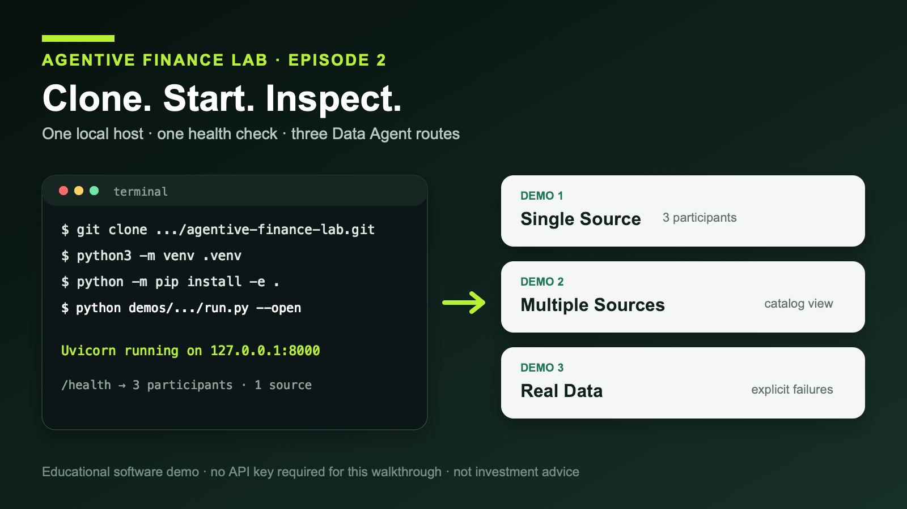

# Clone the Lab and Meet the Network

*One clone, one Python environment, and one command are enough to inspect a
reduced multi-agent finance application locally.*

> Editor’s note: This is the prepared *Agentive Futures* adaptation of Episode
> 2 from Agentive Finance Lab. The consolidated repost job will insert the
> verified canonical Substack URL after publication.



Architecture is easier to evaluate after it runs. Agentive Finance Lab
therefore puts the executable path before the framework vocabulary: clone the
repository, create a clean Python environment, start one local host, inspect a
health response, and open three Data Agent demos.

The lab is a reduced, runnable extraction from FinMAS, the original full
financial multi-agent application. It preserves the roles and request
boundaries needed for the public demonstrations while removing distributed
transport, user accounts, authentication, billing, persistent memory, and
model routing. A successful local run is evidence about this reduced path—not
production readiness.

## Start with the operator path

You need Git, CPython 3.11 or later, and internet access while installing the
package. You do not need an API key, database, Node.js installation, hosted
agent service, or model account.

```bash
git clone https://github.com/alvincho/agentive-finance-lab.git
cd agentive-finance-lab
python3 -m venv .venv
source .venv/bin/activate
python -m pip install -e .
python demos/data-agent-network-demo/run.py --open
```

The launcher in `demos/data-agent-network-demo/run.py` makes a source checkout
runnable by adding the local Prompits Lite, Phemacast Lite, and demo package
roots before delegating to the application entry point.

When the host reports `Uvicorn running on http://127.0.0.1:8000`, keep that
terminal open and verify the first network from another terminal:

```bash
curl --fail --silent http://127.0.0.1:8000/health
```

The compatibility response is deliberately small:

```json
{
  "status": "ok",
  "demo": "data-agent-network",
  "participants": 3,
  "sources": 1,
  "provider": "yfinance"
}
```

It confirms the local Single Source network started with Data User, Data
Consultant, and one YFinance source. It does not guarantee upstream provider
availability, observation freshness, or suitability for a financial decision.

## Three routes, one progression

The local landing page links to:

- `/demos/data-agent-network/` — Single Source;
- `/demos/data-agent-network/multiple-sources/` — Multiple Sources; and
- `/demos/data-agent-network/real-data/` — Real Data.

The first route uses a three-participant YFinance-only network. The second adds
Alpha Vantage and FRED as source-owned catalogs while retaining the same
user-facing and consultant roles. The third instantiates the same
five-participant shape in an isolated local coordinator and exposes bounded
live-fetch samples.

No provider key is required to open the routes, request catalog advice, or
inspect endpoint specifications. Optional Alpha Vantage and FRED keys are read
only by their owning server-side source during a live `data_fetch`. They never
belong in browser storage or a Pulse input.

Open the Single Source route and ask:

```text
I need free daily prices and volume for AAPL.
```

The Consultant answers from synchronized endpoint documentation. That advisory
path performs no provider I/O and no language-model generation. Only a later
`data_fetch` crosses the selected source’s provider boundary.

This is the first useful observation: advice and execution are distinct, and
the interface lets a developer see the transition.

## What this run does—and does not—prove

The local result proves that the reduced checkout installs, starts, registers
its participants, exposes the expected routes, and answers through preserved
application boundaries. It gives us something concrete to inspect when later
episodes introduce Pit, Plaza, Practice, Pulse, Pulser, and Persona.

It does not prove better predictions, higher returns, provider reliability,
data entitlements, production security, or universal superiority over Model
Context Protocol (MCP), skills, or a well-designed single-agent application.
Failures remain explicit: the runtime does not replace unavailable or
unauthorized provider data with fixtures, cached values, synthetic prices, or
another source.

Episode 3 will explain the dependency direction
`demos → phemacast-lite → prompits-lite` and why “lite” is a scope boundary, not
a rewrite.

Run the repository:
https://github.com/alvincho/agentive-finance-lab#quick-start-clone-and-run-the-ui

---

*Agentive Finance Lab is an educational software demonstration. It does not
provide investment advice, trading recommendations, data rights, or guarantees
about provider availability, freshness, completeness, or accuracy. Live data
remains subject to each provider’s terms and limits.*
