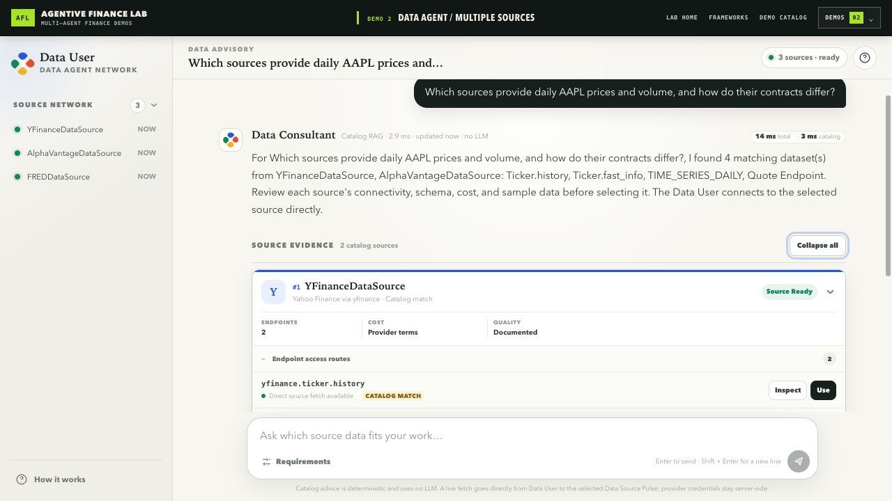

# MCP and Skills Hit Their Limits in Finance: The Multi-Agent Solution

*A runnable demonstration of replacing an overloaded tool catalog with
specialist data agents, centralized discovery, explicit ownership, and
traceable handoffs.*

*Figure 1. A reader-level view of the same architecture: Plaza registers agents,
finds the needed specialist, and mediates the advice and fetch handoffs. Data
Consultant advises from catalog documentation; YFinance Source executes; Data
User returns the accountable result.*

MCP solves an important integration problem: it gives models and applications a
standard way to discover tools and resources, call tools, and read resources.
Skills add reusable instructions for using those capabilities. Both are useful
foundations.

The serious limitation relevant here appears when a financial application
scales. Prices, fundamentals, filings, estimates, options, rates, risk, and
internal portfolio data quickly create hundreds of sources and thousands of
operations. MCP can connect a host to multiple focused servers. But when the
host flattens their operations into one model-visible surface, it still has to
search, understand, authorize, and route across an ever-growing catalog. Large
catalogs consume context and make tool selection fragile. Hiding the catalog
behind one mega-tool reduces the visible count but obscures provider contracts,
permissions, provenance, and failures.

**A coordinated multi-agent system can solve this catalog-and-ownership problem
by moving complexity behind bounded specialists.** The user-facing agent
chooses an appropriate specialist instead of choosing among thousands of
provider functions. Each Data Source agent owns a compact capability surface,
provider semantics, authentication boundary, and failure behavior. Data
Consultant finds and recommends the specialist. Plaza provides centralized
registration, discovery, and coordination. MCP and skills can remain inside
those agents where they are most useful.

This scaling problem matters in finance because even an apparently simple
request crosses several responsibilities. Consider: “Give me one month of
daily AAPL prices.” Someone—or something—must understand the request, identify
an appropriate source, check the source’s contract, supply valid parameters,
handle authentication, execute the call, and report what failed if the data
does not arrive.

A single assistant can attempt all of that. For a prototype, it may even be the
right design. But if every responsibility sits behind one model and one prompt,
the system becomes difficult to inspect. When the answer is wrong, which part
was wrong? Did the user-facing agent misunderstand the request? Did the system
select the wrong dataset? Was the endpoint contract incorrect? Did a provider
reject its key? Or was the upstream service simply unavailable?

“The model failed” is not a useful diagnosis.

Finance raises the cost of that ambiguity. A ticker, time window, adjustment
policy, economic-series vintage, or data entitlement can change the meaning of
the result. Silently substituting another source is not merely an API fallback;
it can change provenance, fields, timing, and permitted use.

That is the problem Agentive Finance Lab is designed to make visible.

## A narrower standard for multi-agent systems

Multi-agent demonstrations often begin with the number of agents. I think that
is the least interesting number in the room.

A useful multi-agent finance application should instead make five properties
observable:

1. **Ownership.** Each participant has a responsibility that is narrow enough
   to explain. The user-facing participant owns intent. The consultant owns
   source knowledge. The source participant owns provider execution.
2. **Discovery.** Participants are found through registered metadata and, for
   Data Sources, advertised Pulse capabilities rather than being hidden as
   hard-coded helper functions inside one agent.
3. **Structured interaction.** Cross-agent work uses named request and response
   boundaries. In this repository, those boundaries are called Pulses.
4. **Inspectable flow.** The code, UI, and named Pulses let a reader follow who
   asked, who advised, which source was selected, and which participant touched
   the provider. This lite demo does not claim a production tracing protocol.
5. **Source-set extensibility.** A source participant can be added without
   rewriting the user-facing role or inventing another orchestration flow.

Those are architectural claims. They are deliberately narrower than claims
about investment performance.

This repository does **not** claim that using more agents produces better
forecasts, higher returns, lower latency, cheaper data, or more accurate market
observations. It does not provide signals, portfolio actions, or trading. Its
purpose is to show whether responsibilities and handoffs become easier to see.

That is enough for a first demonstration—and it is something we can actually
test.

For example, the repository declares a `data_fetch` input contract around an
endpoint identifier and parameter object. Its output declares status, source,
canonical data, field mappings, warnings, and an error boundary. Later episodes
will open that contract in code; for now, the important point is that “fetch
some data” has a visible shape and owner.

The repository also includes a concrete extension check. Demo 1 registers only
YFinance; Demo 2 registers YFinance, Alpha Vantage, and FRED while keeping the
same `DataUserPersona`, `DataConsultantPersona`, and Pulse path. The automated
test `test_multiple_sources_bootstrap_and_advice_use_three_catalog_agents_without_provider_io`
verifies that all three source catalogs appear through that unchanged
user-facing flow. That proves source addition. Arbitrary hot-swapping is a
future production concern, not a claim of this lite demo.

## Three roles, with the boundary in the open

The first use case is a Data Agent Network with three kinds of participant:

- **Data User** owns the chat interaction, captures the requested data, and
  directly calls the selected source after it has been resolved.
- **Data Consultant** owns transient memory containing synchronized copies of
  endpoint and field documentation. It retrieves relevant source knowledge and
  advises the Data User. It does not retrieve provider observations.
- **Data Source** owns the canonical provider documentation exposed to the
  network and executes its own `data_fetch` Pulse. Provider data stays at this
  execution boundary until it is returned to Data User.

These participants do not need an LLM to qualify as agents in this repository.
Each has its own identity and registered card, advertises named Pulses, owns a
bounded role, and handles requests through a Practice boundary. Deterministic
behavior is intentional: the demo is testing the system structure before model
improvisation.

Within each demo, all participants register with one centralized, in-process
**Plaza**. Plaza provides the directory used for registration, discovery, and
resolution, and mediates the local Practice request/return path between
participants. It does not call an upstream provider, interpret observations,
or become another financial-data source.

Figure 1 is intentionally centralized. The agents do not form an
unstructured peer mesh and hope that the right participant eventually answers.
They register in one place, are discovered through explicit metadata, and use
named interaction boundaries.

“Direct” in this design identifies the selected Data Source as the target and
execution owner; it does not mean Plaza disappears. Plaza still mediates the
local Practice call and return, while Data Consultant stays outside the
provider-result path. Every cross-agent arrow in the diagram is logically
caller-to-target and operationally mediated by Plaza.

There is also an important separation inside the sequence. Data Consultant
performs deterministic retrieval over synchronized documentation to answer
“which source and endpoint fit this request?” The implementation retains the
original `catalog_rag` policy label, but the lite path has no language-model
generation step; it is catalog search, not full generative RAG. When
observations are needed, Data User resolves the source and invokes that Data
Source directly. The advisory participant never becomes an invisible data
pipeline.

## Where MCP hits its limits in finance

MCP and skills solve real problems. MCP gives a model or application a common
way to discover tools and resources, call tools, and read resources. A skill
packages instructions and repeatable practice. For one user, a few sources,
and a bounded tool menu, that may be exactly the right architecture.

The problem appears when a financial application tries to expose its entire
data universe through one tool surface. As I argued in
[MCP in Finance Is Great — Until You Need 1,000 Tools](https://medium.com/agentive-futures/mcp-in-finance-is-great-until-you-need-1-000-tools-d09fc350a85e),
finance expands quickly from prices into fundamentals, filings, estimates,
options, rates, risk, and internal portfolio data. Every domain brings its own
endpoints, identifiers, parameters, permissions, limits, and exceptions. The
[MCP maintainers now identify this growing primitive surface as a challenge](https://blog.modelcontextprotocol.io/posts/mcp-roadmap/):
a server with one hundred visible tools makes the model pay for the surface
before the user asks a question, and selection tends to worsen as the list
grows. Four limitations become difficult to ignore in a flat finance catalog:

1. **Catalog overload.** Unless the host filters or progressively reveals the
   available surface, a model must inspect more tool definitions, spend more
   context on provider-specific detail, and make a more fragile selection among
   similar operations. MCP standardizes the definitions; it does not make a
   fully exposed catalog small.
2. **The mega-tool trap.** Collapsing hundreds of operations into something
   like `fetch_everything(spec)` reduces the advertised tool count, but moves
   complexity into an opaque router. The endpoint contract, source decision,
   field mapping, and failure boundary become harder to inspect and test.
3. **Centralized provider knowledge.** In a flat, fully exposed catalog, the
   host's selection layer must choose across the identifiers, adjustment
   policies, vintages, permissions, and exceptions of every provider. A
   reusable skill can improve the procedure, but it does not reduce the size of
   that provider universe or give each provider boundary an independent owner.
4. **Finance-specific operating policy is not supplied by MCP alone.** The
   [2026 MCP specification](https://blog.modelcontextprotocol.io/posts/2026-07-28/)
   adds stateless server scaling, header-based routing, cacheable catalogs, and
   authorization improvements. Those address transport and infrastructure
   scale. Provider selection, entitlements, health policy, quotas, cost policy,
   provenance requirements, and failover remain application concerns. In
   finance, they determine whether a result is usable and explainable.

The multi-agent solution is to make the specialist—not one of its many
functions—the unit of discovery. Data Consultant discovers registered sources
through Plaza, retrieves their catalog knowledge, and recommends an appropriate
specialist. Data User owns the source decision and calls the selected source.
Each Data Source agent owns its provider's compact capability surface,
documentation, credentials, limits, and execution result. Plaza registers,
finds, and coordinates those participants through explicit request and return
boundaries.

In
[Financial Data Should Be a Network of Agents](https://medium.com/agentive-futures/financial-data-should-be-a-network-of-agents-deb0c7f8cb38),
I described the scaling move as choosing a specialist rather than choosing
among an ever-growing list of financial functions. Each source agent can own
its provider's coverage, identifiers, authentication boundary, limitations,
and definitions. The user-facing agent does not have to absorb all of that
provider-specific complexity.

This does not discard MCP or skills. A Data Source agent can expose a compact
MCP surface for its own domain, and a Data Consultant can use a skill to apply a
repeatable evaluation procedure. The coordinated-agent layer supplies the
finance-specific ownership, selection, and handoff boundary used here: which
specialist owns the work, how that specialist is found, and how the request and
result move through the system.

This lite repository demonstrates the smallest useful version of that
solution. Data User owns intent and the selected-source call. Data Consultant
owns catalog advice. Data Source owns provider execution. Plaza registers and
resolves the participants, while named Pulses make the handoffs visible.

It does not implement the enterprise registry described in the earlier
articles: there is no distributed health routing, entitlement engine, quota or
cost policy, or provider failover. The claim is narrower: the demo demonstrates
one application-level decomposition of a flat capability catalog into bounded
ownership, centralized discovery, and explicit coordination. It makes the
boundaries visible where those production controls could be added; it does not
claim to implement them.

## Lite means reduced, not reinvented

The public repository is separate from **FinMAS**, the original full financial
multi-agent application from which this lab was reduced.

Prompits, Phemacast, and Attas are owned by
[Retis AI Pte Ltd](https://retis.ai/). Agentive Finance Lab packages the
reduced, runnable demonstration and its educational material.

It contains three layers:

- **Prompits Lite** retains agent identity (`Pit`), local invocation
  (`Practice`), and the centralized directory (`Plaza`).
- **Phemacast Lite** retains named interactions (`Pulse`), agents that expose
  them (`Pulser`), and role-bearing agents (`Persona`) on top of Prompits Lite.
- **Data Agent demos** retain the original Data User, Data Consultant, Data
  Source roles, and their Pulse names.

“Lite” is a scope boundary. Production services were removed so a visitor can
clone the repository and see the important interactions on one computer. The
demo does not include distributed agent servers, user accounts, Plaza
authentication, leases, billing, persistent memory, model routing, feedback
learning, or a hosted data service.

The central design was not replaced with a new workflow for the public demo.
The point is to preserve enough of the original system to demonstrate the
handoff honestly, while keeping the repository small enough to understand.

## Three demos, one progression

The repository currently contains three Data Agent examples.

**Demo 1: Data Agent / Single Source**

Data User, Data Consultant, and a YFinance Data Source run in one Plaza. The
Consultant answers questions from synchronized YFinance documentation. After
source resolution, Data User can inspect an endpoint specification or call the
YFinance source directly.

**Demo 2: Data Agent / Multiple Sources**

The same workflow registers YFinance, Alpha Vantage, and FRED as independent
Data Source Pulsers. The UI remains catalog- and specification-oriented: it
shows how one Consultant can search transient synchronized copies of three
source-owned catalogs without fetching upstream observations at query time.
The same Data User and Data Consultant classes remain in place; only the
registered source set expands.

*Figure 2. Captured from the locally running Demo 2 deterministic
catalog-advice view: three source agents are registered, and two catalogs match
this AAPL daily-price request. “Ready” means registered in this local run—not
guaranteed upstream availability, entitlement, data quality, or a successful
live fetch. No market observation or LLM-generated recommendation is shown.*

**Demo 3: Data Agent / Real Data**

The same five-participant network is instantiated in a separate Plaza, and the
existing live `data_fetch` path becomes explicit. The keyless sample can return
live AAPL history from YFinance while Alpha Vantage reports
`authentication_required` when no server-side key is configured. Additional
samples let a visitor provide Alpha Vantage or FRED keys in a local `.env` file
and restart the agents.

Despite the name, Demo 3 is not the repository’s first contact with real data:
Demo 1 can already call YFinance. Demo 3 specifically makes multi-provider live
execution, credential ownership, and explicit provider failure visible.

No key is entered in the browser or carried in a Pulse. Results stay separate
by source. Data Consultant never receives provider observations. Plaza mediates
the Pulse invocation but does not call providers or interpret, merge, cache, or
persist their responses. No component hides one provider’s failure behind
another provider.

## A useful demo should fail honestly

The failure behavior is part of the architecture, not an inconvenience to edit
out of a screenshot.

If an Alpha Vantage or FRED key is absent, its Data Source returns an explicit
authentication result. If a provider is unavailable, the request remains a
failure. The runtime does not substitute cached observations, synthetic prices,
test fixtures, or another provider’s response.

This makes the demonstration less magical and more useful. A visitor can see
exactly which participant reached its boundary and why it stopped.

For financial applications, that is a better foundation than a smooth answer
whose provenance is impossible to explain.

## The question for this series

The question behind this ten-episode series is not, “How many agents can we put
on a diagram?”

It is:

> Can we make every important handoff in a financial application explicit
> enough that another developer can run it, inspect it, and add one source
> without redesigning the whole system?

Agentive Finance Lab is a public place to work through that question with
runnable code.

In Episode 2, we will clone the repository, create a clean Python environment,
start the Plaza and agents, open the shared Data User interface, and send the
first Pulse. No API key, database, Node.js installation, or external agent
service will be required.

**Explore the repository:** https://github.com/alvincho/agentive-finance-lab

**Subscribe to the series:** https://agentivefinancelab.substack.com/subscribe

---

*Agentive Finance Lab is an educational software demonstration. It does not
provide investment advice, trading recommendations, data rights, or guarantees
about provider availability, freshness, completeness, or accuracy. Live data
remains subject to each provider’s terms and limits.*

<!--
Publishing checklist:
- Use the Plaza responsibility diagram above as the lead visual or recreate it
  as a high-resolution image with equivalent alt text.
- Confirm all provider and data-use notices remain linked from the repository.
-->
